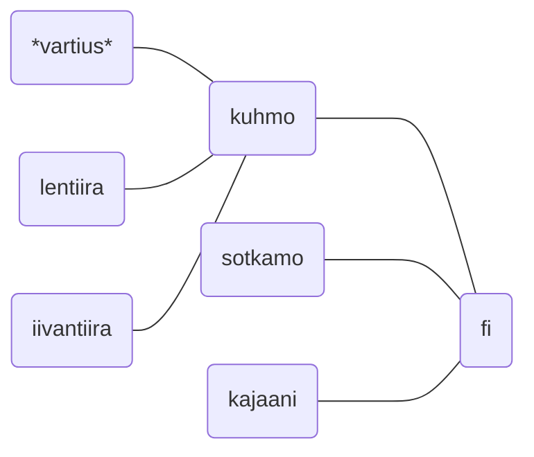

# Verkkotunnus jokaista Kuhmon kylää varten

Kuhmon maaseudun kyliä tulee tukea, jotta ne voivat hyötyä suomalaisesta tietoyhteiskunnasta ja oppivat esimerkkien avulla osallistumaan tietoyhteiskunnan rakentamiseen. Tarkoituksena on toteuttaa älykkään maaseudun ja kestävän kehityksen periaatteita yksinkertaisilla ja helposti ymmärrettävillä toimenpiteillä. 

Kuhmon kaupunki voi vähäisellä kustannuksella ja ylläpidolla tuottaa kylien julkaisutoiminnassaan tarvitsemat verkkotunnukset. Toimenpide luo uuden voimavaran, joka vähentää www-sivuja ylläpitävien kylien vuosittaisia internetmaksuja. Kustannustehokkuuden lisäksi, tällaisen nolla-marginaalia lähentelevän kehitystyön pitemmän aikavälin tavoitteena on tuottaa julkaisualusta myös sellaisille pienemmille kylille, joilla ei vielä ole ollut mahdollisuutta ylläpitää omaa WWW-sivustoa.

Idea perustuu siihen, että Kuhmo - kuten monet muutkin kunnat - on hankkinut nimensä mukaisen verkkotunnuksen (eli domain-nimen) **kuhmo.fi**. Järjestely nojautuu ajatukseen, että **fi** on Suomen maatunnus. **kuhmo.fi** on siis hierarkkisesti maatunnuksen alla toimiva kunta. Samaa ajatusta soveltaen jokaisella kylällä voi luontevasti olla kunnan alitoimialuenimi kunnan alaisuudessa, muotoa: **lentiira.kuhmo.fi**, **iivantiira.kuhmo.fi** jne. Järjestelyn perusteella käyttäjät ymmärtävät, että Lentiira ja Iivantiira sijaitsevat Kuhmossa, samalla tavalla kuten fi-tunnus viestii, että Kuhmo sijaitsee Suomessa.

Verkkotunnusten aikaansaaminen ei maksa kunnalle mitään muuta kuin verkkotunnuksen perustamiseen liittyvän työpanoksen ja näitä paikkakuntakohtaisia domain-nimiä koskevan tiedon ylläpidon verran. Järjestelmän sisäänajon jälkeen kyseisiä muutoksia tapahtuu ani harvoin. Esimerkiksi Iivantiiran verkkosivuston tiedot eivät ole kylän www-sivuston perustamisen jälkeen kertaakaan muuttuneet.

Kuhmossa on tavoiteltu sopimuksellisuutta. Jos kunta tukee kylien tiedotustarpeita tässä ehdotuksessa kuvatulla tavalla, tämä voisi olla ensi askel sopimuksellisuuden rakentamisessa. 

Toimenpidettä on tarkoitus toteuttaa vaiheittain. Toimenpide kohdistuu ensimmäisessä vaiheessa Luoteis-Kuhmon kyliin (Hietaperä, Ala-Vieksi, Ylä-Vieksi, Härmänkylä, Kuusamonkylä, Iivantiira), joihin on jo rakennettu nopeaa laajakaistaa. Kyliä varten on haettu LähiTapiola Kainuu-Koillismaa Oy:n aluekehitysrahaa, jolla on tarkoitus hankkia jokaista Luoteis-Kuhmon kylää varten oman WWW-julkaisualustan tuottavan pienoistietokoneen.

Vaikuttavuudesta voinee todeta, että tiettävästi vastaavanlaista rakennetta ei ole keksitty hyödyntää muualla Suomessa. Tällöin Kuhmolla on mahdollisuus toimia edelläkävijänä. Tämä sivusto toimii esimerkkinä siitä miten digitaalista kuilua voi pienentää julkaisutoimintaa helpottavalla yksinkertaisilla toimenpiteillä. Tämä suunnitelma on kirjoitettu Markdown-merkintöjen avulla. Ilmainen julkaisualusta muokkaa Markdown-tekstin läpinäkyvästi WWW:ssä julkaistavaksi HTML-sivuksi ja esimerkiksi sähköpostiin liitettäväksi PDF-asiakirjaksi.
