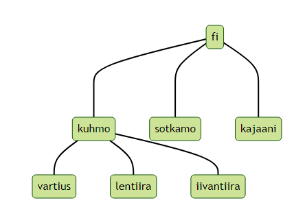

# Verkkotunnus jokaista Kuhmon kylää varten

Kunnan perustehtävänä on edistää kuntalaisten hyvinvointia, yhteisöllisyyttä ja alueen elinvoimaa. Kuhmon maaseudun kyliä tulee tukea, jotta ne voivat hyötyä suomalaisesta tietoyhteiskunnasta ja oppia esimerkkien avulla osallistumaan tietoyhteiskunnan rakentamiseen. 

Tämän ehdotuksen tarkoituksena on toteuttaa älykkään maaseudun ja kestävän kehityksen periaatteita yksinkertaisilla ja helposti ymmärrettävillä toimenpiteillä, joista kylien verkkotunnuksien perustaminen on ensimmäinen askel.

Kuhmon kaupunki voi vähäisellä kustannuksella ja ylläpidolla tuottaa kylien julkaisutoiminnassa tarvittavat verkkotunnukset. Kylien verkkotunnukset luovat uuden voimavaran, joka vähentää www-sivustoja ylläpitävien kylien vuosittaisia internetmaksuja. Kustannustehokkuuden lisäksi, tämän kulujen nolla-marginaalia edistävän kehitystyön pitemmän aikavälin tavoitteena on tuottaa julkaisualusta myös sellaisille pienemmille kylille, joilla ei vielä ole ollut taloudellisia edellytyksiä ylläpitää omaa WWW-sivustoa.

Idea perustuu siihen, että Kuhmo — kuten kaikki Suomen kunnat — on hankkinut nimensä mukaisen verkkotunnuksen (toimialue- eli domain-nimen) **kuhmo.fi**. Järjestely nojautuu ajatukseen, että **fi** on Suomen maatunnus (Ahvenanmaan maatunnus on **ax**). **kuhmo.fi** on siis hierarkkisesti maatunnuksen alla toimiva kuntatunnus, siinä missä **sotkamo.fi** ja **kajaani.fi**. Samaa ajatusta soveltaen jokaisella kylällä voi luontevasti olla oma alitoimialuenimi kunnan alaisuudessa: **vartius.kuhmo.fi**, **lentiira.kuhmo.fi**, **iivantiira.kuhmo.fi** jne. Järjestelyn perusteella ulkopuoliset käyttäjät ymmärtävät, että Lentiira ja Iivantiira sijaitsevat Kuhmossa, samalla tavalla kuten fi-tunnus viestii, että Kuhmo sijaitsee Suomessa.

Verkkotunnusten aikaansaaminen ei maksa kunnalle mitään muuta kuin verkkotunnuksen perustamiseen liittyvän työpanoksen ja näitä paikkakuntakohtaisia domain-nimiä koskevan tiedon ylläpidon verran. Järjestelmän sisäänajon jälkeen kyseisiä muutoksia tapahtuu ani harvoin. Esimerkiksi Iivantiiran WWW-sivuston verkkotunnuksen tiedot eivät ole kylän sivuston perustamisen jälkeen kertaakaan muuttuneet.

Kuhmossa on tavoiteltu sopimuksellisuutta. Jos kunta tukee kylien tiedotustarpeita tässä ehdotuksessa kuvatulla tavalla, tämä voisi olla ensi askel Kuhmossa tavoitellun sopimuksellisuuden rakentamisessa. Vastavuoroisuudessa tarvitaan kuitenkin vähintään kaksi yhteisöllisesti toimivaa osapuolta.

Toimenpidettä on tarkoitus toteuttaa vaiheittain. Uudistus kohdistuu ensimmäisessä vaiheessa Luoteis-Kuhmon kyliin (Hietaperä, Ala-Vieksi, Ylä-Vieksi, Härmänkylä, Kuusamonkylä, Iivantiira), joihin on jo rakennettu nopeaa laajakaistaa. Kyläverkot rakentanut osuuskunta on hakenut LähiTapiola Kainuu-Koillismaa Oy:n aluekehitysrahaa kylien palvelimia varten. Tuella on tarkoitus hankkia jokaista Luoteis-Kuhmon kylää varten oman WWW-julkaisualustan tuottavan pienoistietokoneen.

Idan vaikuttavuudesta voinee todeta, että tiettävästi vastaavanlaista rakennetta ei ole keksitty hyödyntää muualla Suomessa. Tällöin Kuhmolla on mahdollisuus toimia edelläkävijänä. 

Tämä WWW-sivu toimii esimerkkinä siitä, miten digitaalista kuilua voi pienentää julkaisutoimintaa helpottavalla yksinkertaisilla toimenpiteillä. Suunnitelma on kirjoitettu Markdown-merkintöjen avulla. Ilmainen julkaisualusta GitHub muuntaa Markdown-tekstin läpinäkyvästi WWW:ssä julkaistavaksi HTML-sivuksi.
